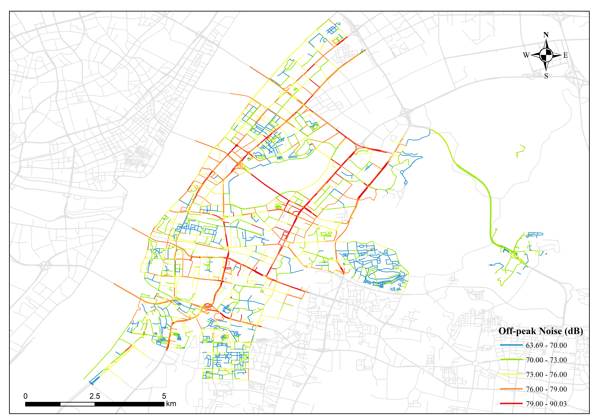

# Noise-Estimation-Model-for-Wuhan
A machine learning approach to noise estimation

We developed a machine learning framework for road noise training and prediction, integrating visual environmental features extracted from street view images and road functional attributes derived from POI data.
Wuchang District in Wuhan was selected as the case study area. The best model achieved a performance of MAE = 2.00, MAPE = 2.65, RMSE = 2.70, and R² = 0.71.
